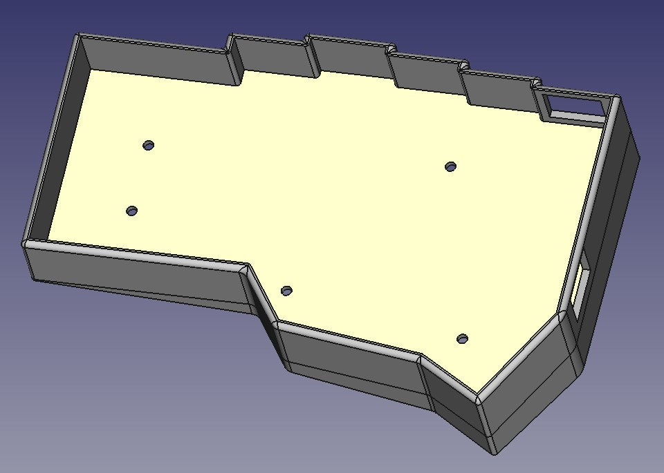
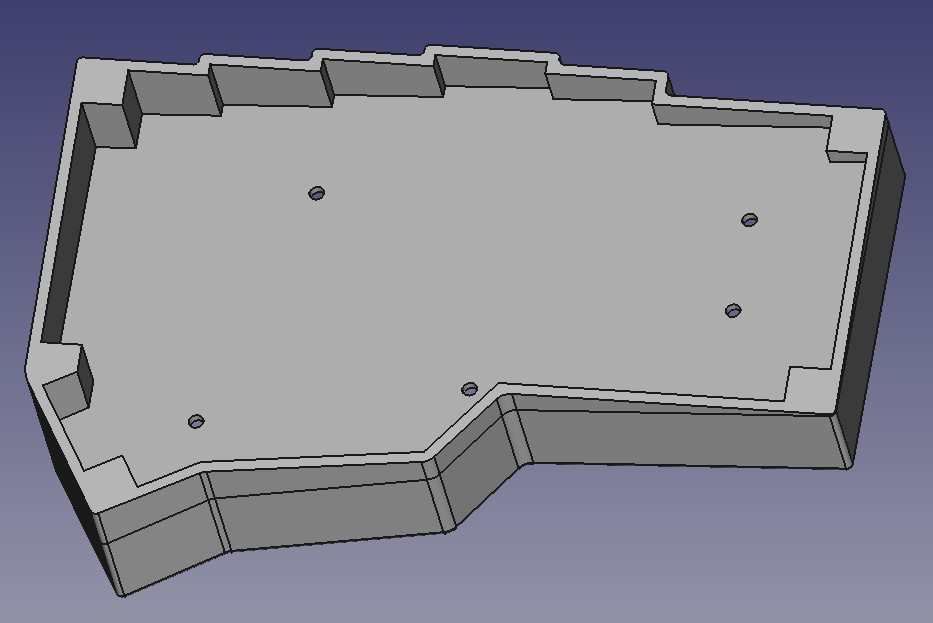
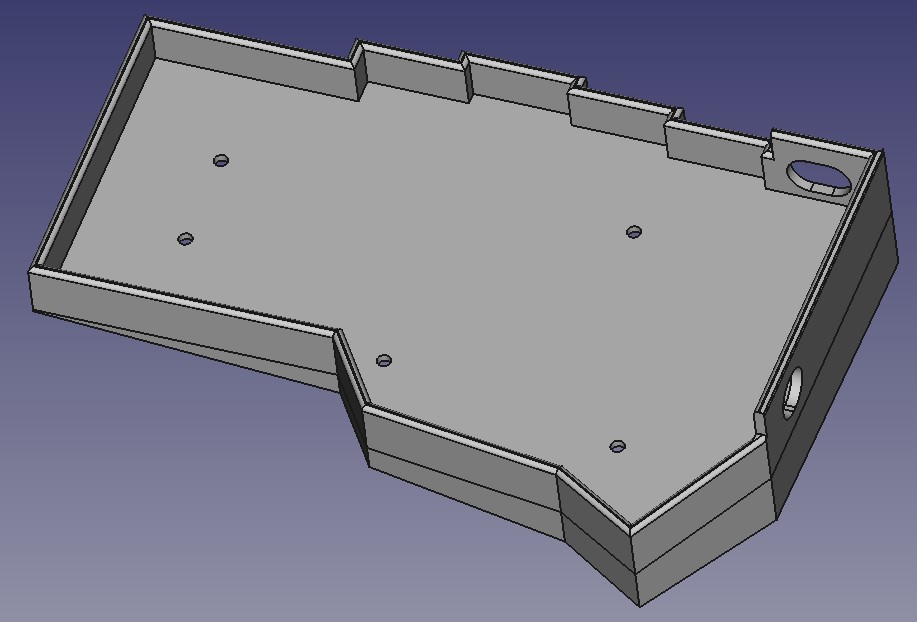
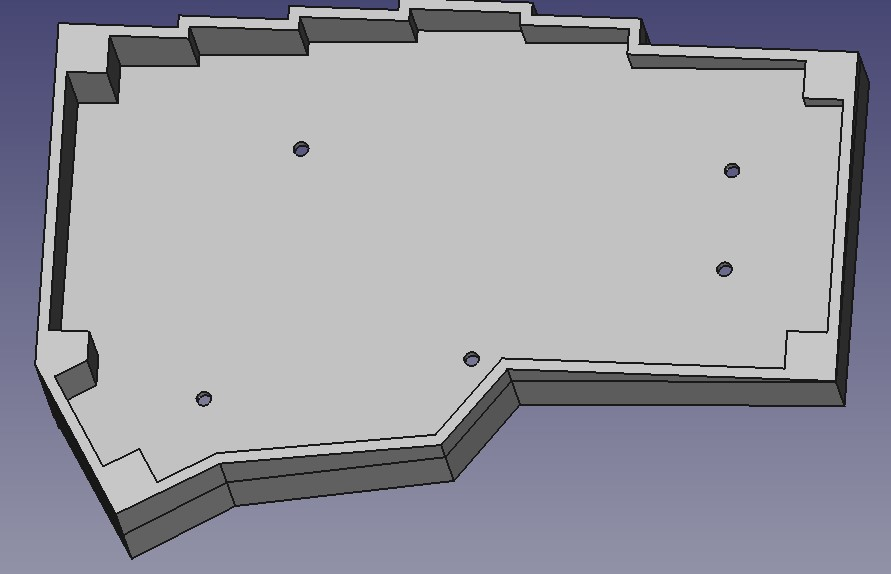
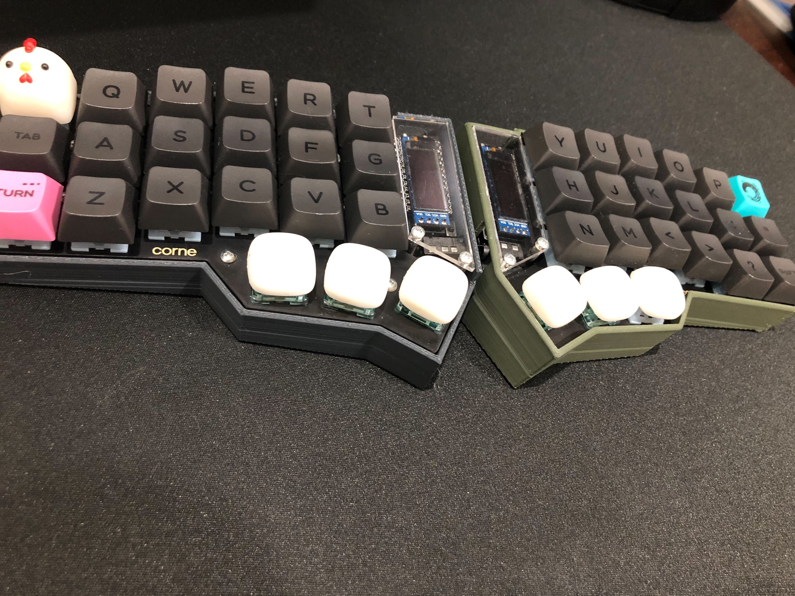
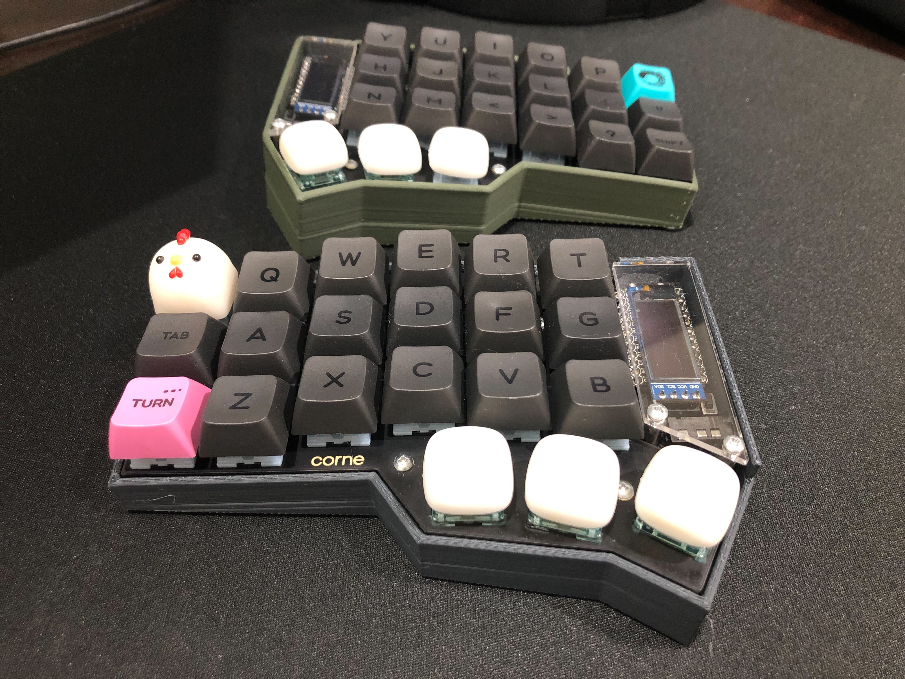

# Corne V3 cherry case

A simple keyboard case.

The keyboard named [corne](https://github.com/foostan/crkbd/tree/main) was designed by [foostan](https://github.com/foostan).

This is a case for corneV3 with a slight tilt.

## Case

## CaseB

## photo

